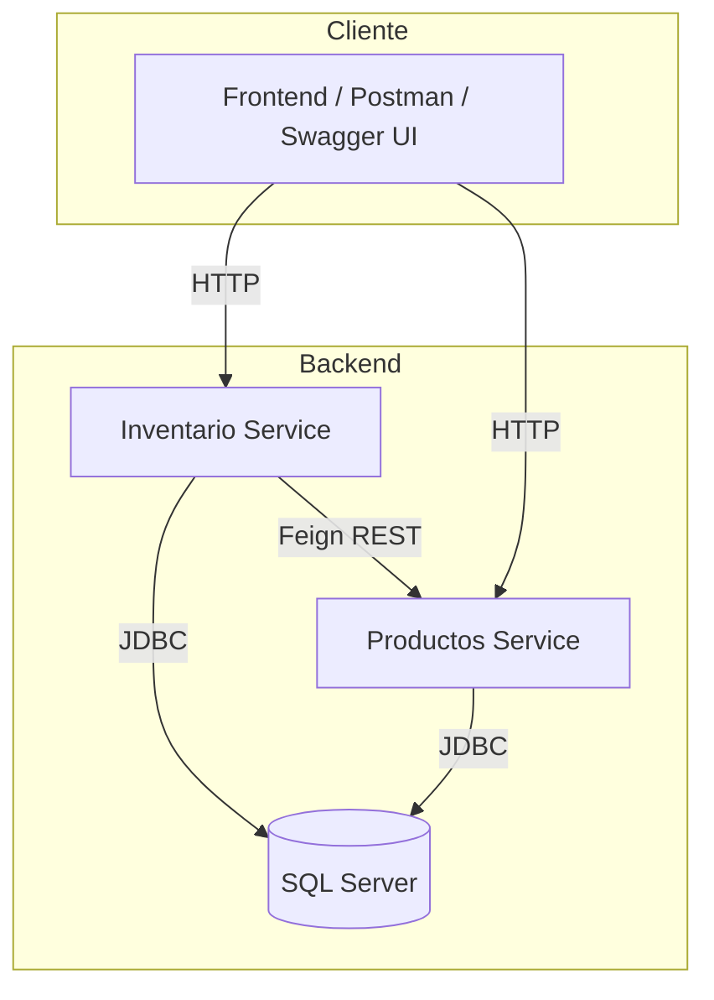

# Inventario Service

Microservicio de inventario para la gestión de productos. Forma parte de un sistema de microservicios junto con el microservicio de productos.

---

## Tecnologías utilizadas

- Java 21
- Spring Boot 3.5
- Spring Data JPA
- Spring Security
- Spring Cloud OpenFeign
- SQL Server (driver: `mssql-jdbc`)
- Spring Retry y AOP
- OpenAPI/Swagger (`springdoc-openapi`)
- Docker y Docker Compose
- Maven

---

## Requisitos previos

- Java 21+
- Maven 3.8+
- Docker y Docker Compose

---

## Instalación y Ejecución

### 1. Clona el repositorio

```sh
git clone https://github.com/Programvr/Backend_Productos.git
```

### 2. Compila los microservicios

Antes de levantar los contenedores, debes compilar ambos microservicios para generar los archivos `.jar` necesarios para las imágenes Docker. Ejecuta estos comandos desde la raíz del proyecto:

```sh
cd inventario-service
mvn clean package -DskipTests
cd ../productos-service
mvn clean package -DskipTests
cd ..
```

Esto generará los archivos JAR en las carpetas `target/` de cada microservicio.

### 3. Configuración

El archivo `src/main/resources/application.properties` ya contiene la configuración necesaria para la base de datos y la conexión al microservicio de productos.

Asegúrate de que:
- La variable `productos.api.key` coincida con la del microservicio de productos.
- El microservicio de productos esté disponible (puedes levantarlo con Docker Compose junto con este servicio).

### 4. Levanta los servicios con Docker Compose

En la raíz del proyecto (donde está el `docker-compose.yml`):

```sh
docker-compose up --build
```

Esto levantará:
- inventario-service
- productos-service 
- SQL Server 

### 5. Pruebas

Para ejecutar los tests unitarios y de integración:

```sh
mvn clean test
```

### 6. Uso

- El servicio se expone por defecto en el puerto **8081**.
- Endpoints principales:
    - `GET /api/inventario/{productoId}`
    - `POST /api/inventario`
    - `PUT /api/inventario`
- Todos los endpoints requieren el header `X-API-KEY` con el valor configurado en `application.properties`.

#### Documentación OpenAPI

Accede a la documentación Swagger en:  
`http://localhost:8081/swagger-ui.html`  
`http://localhost:8080/swagger-ui.html`  
o  
`http://localhost:8081/swagger-ui/index.html`  
`http://localhost:8080/swagger-ui/index.html`

### 7. Variables importantes

- `productos.api.key`: API Key para consumir el microservicio de productos.
- `api.key`: API Key para proteger los endpoints de inventario.

### 8. Apagar los servicios

```sh
docker-compose down
```

---

## Estructura del proyecto

```
inventario-service/
│
├── src/
│   ├── main/
│   │   ├── java/
│   │   └── resources/
│   │       └── application.properties
│   └── test/
│
productos-service/
│── src/
│   ├── main/
│   │   ├── java/
│   │   └── resources/
│   │       └── application.properties
│   └── test/
│
docker-compose.yml
Dockerfile.sqlserver
README.md
```

---

## Notas

- Si modificas los puertos o credenciales en `application.properties`, asegúrate de reflejar los cambios en el `docker-compose.yml`.
- Puedes probar los endpoints con Postman o cualquier cliente HTTP, recuerda incluir el header `X-API-KEY`.
- El microservicio de productos debe estar corriendo y accesible para que las operaciones funcionen correctamente.

---

## Justificación de decisiones técnicas

### Elección de SQL Server como base de datos relacional

- **Integridad y transaccionalidad:** SQL Server ofrece un sólido soporte ACID, ideal para la gestión de inventarios y productos donde la consistencia de los datos es crítica.
- **Compatibilidad empresarial:** Es ampliamente utilizado en entornos corporativos, facilitando la integración con otros sistemas existentes.
- **Herramientas y soporte:** Dispone de herramientas avanzadas de administración, monitoreo y respaldo, además de una amplia documentación y comunidad.
- **Escalabilidad y rendimiento:** Permite manejar grandes volúmenes de datos y consultas complejas, adaptándose al crecimiento del sistema.

### Elección de Java 21 y Spring Boot 3.5

- **Actualización tecnológica:** Java 21 es una versión LTS moderna, con mejoras en rendimiento y seguridad.
- **Productividad y comunidad:** Spring Boot acelera el desarrollo de microservicios y cuenta con una gran comunidad y soporte para integración con bases de datos, seguridad y APIs REST.
- **Facilidad de pruebas y despliegue:** Permite pruebas automatizadas y despliegue sencillo en contenedores Docker.

### Arquitectura basada en microservicios

- **Escalabilidad independiente:** Cada servicio puede escalarse según la demanda específica.
- **Despliegue y mantenimiento desacoplado:** Permite actualizar y mantener cada microservicio de forma independiente, reduciendo riesgos.
- **Facilidad de integración:** Uso de OpenFeign para comunicación entre microservicios y OpenAPI/Swagger para documentación y pruebas.

### Uso de Docker y Docker Compose

- **Portabilidad:** Garantiza que la aplicación se ejecute igual en cualquier entorno.
- **Orquestación sencilla:** Docker Compose permite levantar todos los servicios y dependencias con un solo comando, facilitando el desarrollo y pruebas integradas.

---

## Diagramas de arquitectura y flujo de datos

### Arquitectura general



- **Inventario Service** y **Productos Service** son microservicios independientes.
- Ambos se comunican con la base de datos **SQL Server**.
- El Inventario Service consume el Productos Service usando **OpenFeign**.
- Los clientes (frontend, Postman, Swagger UI) pueden interactuar con ambos servicios vía HTTP.

### Flujo de datos típico: Consulta de inventario

1. **Cliente** realiza una petición HTTP a Inventario Service (`GET /api/inventario/{productoId}`).
2. **Inventario Service** valida la API Key y consulta su base de datos.
3. Si necesita información adicional del producto, llama a **Productos Service** usando OpenFeign.
4. **Productos Service** responde con los datos del producto.
5. **Inventario Service** responde al cliente con la información consolidada.

---

> **Nota:** Puedes personalizar los diagramas usando [Mermaid](https://mermaid-js.github.io/) o incluir imágenes generadas con herramientas como draw.io, Lucidchart, etc., si tu plataforma de documentación lo soporta.

## Autor

Marlon Valbuena - https://github.com/Programvr